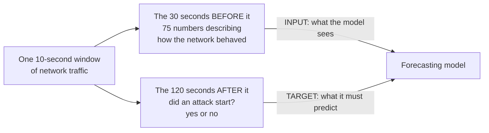
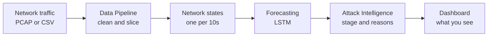

# How to use this document

This is everything you need to present VectorFlow, written so that any member
of the team can pick it up and speak confidently, even if you did not write the
code yourself.

Read it once, end to end. It takes about twenty minutes.

**Three kinds of content are mixed together, and they are marked clearly:**

- **Plain sections** explain what the project is and how it works. Read them to
  understand.
- **Blocks that begin with "Say this"** are written the way you would actually
  speak them out loud. You can use them almost word for word. They are not
  meant to be memorised, only to give you a rhythm and the right words.
- **The cross-questioning section near the end** is a bank of the questions
  judges realistically ask, each with an answer. Every answer has a short
  **Core** line at the end. If your mind goes blank under pressure, say the
  Core line and stop. It is always enough.

**The one rule for the whole team:** never guess in front of a judge. If you do
not know something, say "I do not have that number in front of me, but I can
tell you how we measure it." That answer builds trust. A confident wrong answer
destroys it.

**Before you walk in,** read the last two pages: the cheat sheet and the
checklist. They are designed to be the last thing you look at.

---

# The problem

## The plain version

Today, almost every security tool in the world answers the same question:
**"Is something bad happening right now?"**

That question is asked too late.

By the time a firewall raises an alarm, the attacker is already inside the
network. By the time an intrusion detection system flags traffic, the scan has
already finished, the password has already been guessed, or the data has
already started leaving the building. Security teams spend their days reading
notifications about damage that has already been done.

An attack is not a single moment. It is a sequence. Someone scans your network
for open doors. Then they try passwords on the doors they found. Then they move
sideways to more valuable machines. Then they take the data out. Each of those
steps leaves a trace in the network traffic, and the earlier steps happen
*before* the damage.

So the traces are there. Nobody is reading them forward.

## Why this matters

The gap between "an attack is beginning" and "an attack has succeeded" is where
a defender can actually act: block an address, force a password reset, isolate
a machine, wake up a human. That window is usually a couple of minutes long.
Miss it, and you are no longer defending. You are cleaning up.

> **Say this:**
>
> "Every security product on the market is built to answer one question: is
> something bad happening right now? The problem is that by the time you can
> answer that question, the attack has already worked. The scan is done, the
> password is guessed, the data is already moving.
>
> But an attack isn't one moment, it's a sequence. Somebody knocks on doors
> before they walk through one. All of that is sitting in the network traffic,
> minutes before the damage. Nobody is reading it forward.
>
> That's the gap we went after."

---

# The one idea that makes us different

If you remember nothing else from this document, remember this section. It is
the heart of the project and it is the thing that separates VectorFlow from a
hundred other network security projects.

## Detection versus forecasting

**Detection** looks at traffic and asks: *is this traffic an attack?*

**Forecasting** looks at traffic and asks: *is an attack about to start?*

These sound similar. They are completely different problems, and almost every
project that claims to do the second is quietly doing the first.

Here is how that mistake happens. You take network data, you label each moment
"attack" or "normal", and you train a model to predict the label. The model
learns to recognise what an attack looks like while it is happening. That is
detection wearing a forecasting costume. It cannot warn you about anything,
because it needs to see the attack before it can say the word "attack".

## How we made it impossible to cheat

We built our training data so that the model is *structurally incapable* of
doing detection.

For every ten-second slice of traffic, we look at what happened in the **next
two minutes**, and that is the answer the model must learn to predict. The
current moment is deliberately excluded from the answer.

Then we go further. Any slice of time where an attack was **already running**
was **deleted from the training set entirely**. We removed 6,238 of them.

Think about what that means. The model has never once been shown an attack in
progress and been rewarded for recognising it. Every single example it learned
from is a moment that looked ordinary, followed by an attack that had not
started yet. It has no choice but to learn the early warning signs, because the
obvious signs were never available to it.

> **Say this:**
>
> "There's a trap in this problem that a lot of people fall into. You train a
> model on network data labelled attack or normal, and it learns to recognise
> an attack while it's happening. That's detection dressed up as prediction.
> It can't warn you about anything.
>
> So we designed the data to make that impossible. For every ten seconds of
> traffic, the thing our model has to predict is what happens in the *next two
> minutes*. And every moment where an attack was already running, we deleted
> from training. Six thousand two hundred and thirty-eight of them, gone.
>
> Our model has literally never been shown an attack in progress and rewarded
> for spotting it. It only ever saw quiet traffic followed by trouble. So the
> only thing it can possibly have learned is the early warning signs."

**This is the strongest thirty seconds you have. Deliver it slowly.**

---

# What VectorFlow is

**In one breath:** VectorFlow reads network traffic, breaks it into ten-second
snapshots, and uses a trained AI model to predict how likely it is that an
attack will begin in the next two minutes. It then names which stage of an
attack it is watching, explains in plain English what made it suspicious, and
shows all of it live on a dashboard.

It runs entirely on one laptop with the internet switched off.

## The five stages

| Stage | What happens |
|---|---|
| **Network traffic** | A PCAP or CSV of flows arrives. |
| **Data Pipeline** | Cleans it and slices it into ten-second windows, 75 measurements each. |
| **Network states** | One snapshot of the whole network, every ten seconds. |
| **Forecasting** | An LSTM reads the sequence and returns the risk of an attack starting in the next 120 seconds. |
| **Attack Intelligence** | Names the MITRE stage and the reasons behind it. |
| **Dashboard** | Shows a defender the risk, the stage and the explanation, refreshed every two seconds. |

> **Say this:**
>
> "VectorFlow takes network traffic, slices it into ten-second snapshots, and
> for each snapshot it predicts the probability that an attack will begin in
> the next two minutes. Then it tells you which stage of an attack it's looking
> at, and it explains in plain English what made it suspicious. All of it on a
> live dashboard, all of it running offline on a single laptop."

---

# How it works, stage by stage

## Stage 1: Turning traffic into snapshots

Network traffic arrives as a list of **flows**. A flow is one conversation
between two machines: who talked to whom, for how long, how many packets, how
many bytes.

There can be tens of thousands of flows per minute, and individually they tell
you almost nothing. So we group them by time. Every **ten seconds** of traffic
becomes one snapshot, which we call a **network state**.

Why ten seconds? Short enough that a fast attack does not hide inside a single
snapshot, long enough that ordinary traffic noise averages out.

## Stage 2: Describing each snapshot with numbers

For each snapshot we measure **75 numbers**. They come from three places:

- **15 measurements of the snapshot itself** — how many flows, how many packets
  forward and back, how many bytes, how many different destination ports were
  touched, and how many connection-control flags of each type appeared. Those
  flags matter: a `SYN` flag means "I want to open a connection", a `RST` means
  "connection refused". A machine sending a flood of `SYN`s and collecting a
  flood of `RST`s is knocking on doors that are not opening.
- **45 numbers of recent history** — the same 15 measurements from ten, twenty
  and thirty seconds ago.
- **15 numbers of change** — how much each measurement moved since the previous
  snapshot.

That last two groups are the important design choice. A single snapshot cannot
tell you whether traffic is *rising*. Attacks announce themselves through
change, not through absolute volume, so we hand the model the recent past and
the direction of travel, not just the present.

## Stage 3: The forecast

Those numbers go into a trained **LSTM** model. An LSTM is a neural network
built for sequences: it reads a series of snapshots in order and carries a
memory of what it has already seen, so it can recognise a *pattern developing
over time* rather than judging each moment in isolation.

That is exactly the shape of this problem. A single quiet snapshot is not
suspicious. A quiet snapshot at the end of a slow, steady climb is.

The model outputs a single number: **the probability that an attack begins
within the next 120 seconds.** That number is the risk score on the dashboard.

## Stage 4: Making the number mean something

A percentage on its own does not help a defender. So a separate module turns it
into two useful things.

**A stage.** We map the situation onto the MITRE ATT&CK framework, the industry
standard vocabulary for describing what an attacker is doing. We use four
stages, in the order an attack actually unfolds:

| Stage | MITRE ID | What it means in plain words |
|---|---|---|
| Reconnaissance | TA0043 | Looking around. Scanning for open doors. |
| Initial Access | TA0001 | Trying to get in. Guessing passwords. |
| Lateral Movement | TA0008 | Inside, and spreading to other machines. |
| Exfiltration | TA0010 | Taking the data out. |

**A reason.** We compare every measurement against its own recent normal and
report the three that moved furthest, in a readable sentence. For example:
*"SYN Flag Count is 75% above its recent baseline; traffic supports the Initial
Access stage."*

## Stage 5: The dashboard

Everything is served by a small local API and drawn on a web dashboard that
refreshes every two seconds. That is the entire system.

> **Say this:**
>
> "Traffic comes in as flows, individual conversations between machines. We
> group every ten seconds into one snapshot, and we describe each snapshot with
> seventy-five numbers.
>
> Fifteen of those describe right now. Forty-five describe the last thirty
> seconds. Fifteen describe how fast things are changing. That's deliberate,
> because attacks show up as *change*, not as volume. A busy network isn't
> suspicious. A network that just got busy in a particular way is.
>
> That sequence goes into an LSTM, which is a neural network built to read
> sequences and remember what it's seen. It gives us one number: the probability
> an attack starts in the next two minutes.
>
> Then we translate that number into something a human can act on: which stage
> of an attack this is, in MITRE ATT&CK terms, and which measurements moved to
> make us think so."

---

# The data we trained on

## Where it comes from

We use **CSE-CIC-IDS2018**, built by the Canadian Institute for Cybersecurity
with the Communications Security Establishment of Canada. It is one of the most
widely used public benchmarks in network security research.

They built a realistic enterprise network on cloud infrastructure, ran genuine
attack tools against it for two weeks, and recorded every packet with full
knowledge of exactly when each attack started and stopped. That last part is
what makes it valuable: it gives us trustworthy ground truth, which you cannot
get from a real corporate network.

## What we did with it

The raw capture is about **2.5 GB across nine days**. Turning that into
something a model can learn from took nine cleaning steps, and the numbers are
worth knowing because judges do ask.

| Step | Rows |
|---|---|
| Ten-second windows built from the raw traffic | **37,715** |
| Removed: gaps where the capture had no data at all | −13,313 |
| Removed: windows where an attack was *already running* | −6,238 |
| **Usable training rows** | **17,356** |

Of those 17,356 rows, **1,440 are positive** — that is, followed by an attack
within two minutes. That is **8.3%**, and those positives come from **357
genuinely separate attack onsets**.

The final training file is **12.5 MB**. We compressed 2.5 GB of raw traffic into
twelve megabytes of signal.

## The two decisions that matter

**We split the data by day, never randomly.** The three snapshots before an
attack are ten seconds apart and look nearly identical. If you shuffle randomly,
near-copies of the same moment end up on both sides of the split, the model
effectively sees the test answers during training, and your scores come out
beautiful and meaningless. So we train on four days, tune on a fifth, and test
on two days the model has never touched.

**We left the class imbalance alone.** Only 8.3% of rows are positive, and the
tempting fix is to duplicate positives until the classes balance. We did not,
because that destroys the time ordering the whole method depends on. Instead we
weight the rare class during training and we judge the model on precision and
recall, never on accuracy.

That second point deserves emphasis: **on this dataset, a model that predicts
"no attack" every single time scores about 91% accuracy while catching exactly
zero attacks.** Accuracy is a meaningless number here, and we do not report it.

> **Say this:**
>
> "We trained on CIC-IDS 2018 from the Canadian Institute for Cybersecurity.
> They built a real enterprise network, ran real attack tools against it for
> two weeks, and recorded everything, so we get trustworthy ground truth about
> exactly when each attack started.
>
> Two and a half gigabytes of raw capture came in. We built thirty-seven
> thousand windows, threw out thirteen thousand where the capture had gaps, and
> deleted six thousand where an attack was already running. Seventeen thousand
> usable rows, behind three hundred and fifty-seven separate attack onsets.
>
> One thing worth saying: we split the data by day, never randomly. The
> snapshots right before an attack are ten seconds apart and nearly identical,
> so a random split leaks them across training and testing and your numbers
> come out great and mean nothing. And we never quote accuracy, because a model
> that says 'no attack' every single time scores ninety-one percent on this
> data while catching zero attacks."

---

# The three modules

The system is built as three independent modules behind a shared set of typed
contracts. Five roles on the team, one module each, plus integration and the
application layer.

| Role | Owns |
|---|---|
| Tech Lead and Integration | Architecture, contracts, code review, wiring it together |
| Data Pipeline | Cleaning, feature engineering, time windows |
| ML Forecasting | Training and serving the model |
| Attack Intelligence | MITRE stage mapping and explanations |
| Backend and Dashboard | The API and the user interface |

## Module 1: Data Pipeline

**Job:** raw traffic in, clean numbered snapshots out.

Real network data is messy in specific, annoying ways, and this module handles
each one: header rows repeated in the middle of files, exact duplicate records,
dates written day-first that Python reads month-first, infinite values from
divide-by-zero, and gaps where the capture simply stopped. Gaps are marked as
*missing data*, never as *quiet traffic*, because the difference between
"nothing happened" and "we weren't watching" matters enormously to a model.

**The part worth bragging about:** the same code that built our training file is
the code that runs live. Not a reimplementation, the same functions. This kills
an entire category of bug where a model performs beautifully in testing and
falls apart in production because the live data is subtly shaped differently.

And we do not just claim it. There is an automatic self-check that builds a
sample file, runs it through both paths, and asserts the two results are
identical to **zero difference**. If someone changes one path and forgets the
other, the check fails.

> **Say this:**
>
> "The pipeline handles all the ugly parts of real data: repeated headers,
> duplicates, dates in the wrong format, gaps in the capture. And it's careful
> about one thing in particular. When the capture has a gap, we mark it as
> missing data, not as quiet traffic, because 'nothing happened' and 'we weren't
> looking' are very different things to a model.
>
> The bit I'd point at is this: the same code that built our training file is
> the code that runs live. And we don't just say that, there's a self-check that
> runs both paths and asserts the outputs match to zero difference. That kills
> the classic failure where a model works in the lab and breaks in production
> because the live data is shaped slightly differently."

## Module 2: ML Forecasting

**Job:** a sequence of snapshots in, one probability out.

The model is an **LSTM**, a neural network designed for sequences. It reads
snapshots in order and carries a memory of what came before, so it can pick up
a pattern that develops across time rather than judging each moment alone.

We chose a sequence model deliberately. We started with tree-based classifiers
as a baseline, which is the sensible first thing to try, but they judge each
snapshot on its own numbers. This problem is fundamentally about *how traffic is
changing over time*, and that is precisely what an LSTM is built to capture.

**Input:** the recent sequence of network states, 75 numbers each.
**Output:** the probability that an attack begins within the next 120 seconds.

**How we judge it:** precision and recall, never accuracy, for the reason in the
previous section. Precision answers "when we raise an alarm, how often are we
right?" Recall answers "of all the attacks that happened, how many did we
catch?" Those are the two numbers a security team actually cares about, because
they map onto the two ways a system fails: crying wolf, and missing the wolf.

## Module 3: Attack Intelligence

**Job:** turn a probability into something a human can act on. No machine
learning here at all, just clear rules, which means every decision it makes can
be traced and explained.

**Naming the stage.** For each MITRE stage we defined the measurements whose
rise is characteristic of it. Reconnaissance shows up as many different
destination ports being touched. Initial Access shows up as connection attempts
being refused, lots of `RST` and `FIN` flags. Exfiltration shows up as bytes
flowing outward. We compare each measurement against its own recent normal and
score how much evidence there is for each stage.

**The rule worth explaining out loud.** A stage is only declared when **two
independent things agree**: the traffic pattern shows evidence for that stage,
*and* the model's risk score is high enough to support it. Either alone is not
enough.

This is deliberate and it is tested. A risk spike over quiet traffic will not
move the stage. A burst of traffic with a low risk score will not move it
either. Both keys have to turn. It means the stage on screen is never the result
of one noisy number, and the two halves of the system act as a check on each
other.

We also smooth over three snapshots, so a single momentary spike contributes
only a third of the evidence a stage needs. That is what stops the display
flickering between stages.

**Explaining the reason.** We rank every measurement by how far it has moved
from its own recent baseline and report the top three in a sentence. Note the
precise claim here: this explains **what changed in the traffic**, computed
independently of the model. It is not an inspection of the model's internal
reasoning. That distinction matters and there is a prepared answer for it in the
Q&A section.

> **Say this:**
>
> "This module turns a percentage into something a human can act on, and it's
> pure rules, no machine learning, so every decision it makes can be traced.
>
> The design point I like is this: we only declare a stage when two independent
> things agree. The traffic pattern has to show evidence for that stage, *and*
> the model's risk has to be high enough to back it up. Either one alone isn't
> enough. So a risk spike over quiet traffic won't move the stage, and a burst
> of traffic with low risk won't either. Both keys have to turn. The two halves
> of the system check each other."

---

# What the judge sees on screen

The dashboard has seven panels. Know what each one is, because judges point at
things.

| Panel | What it shows |
|---|---|
| **Traffic summary** | Windows seen, flows, packets, bytes so far this session |
| **Network status** | Session ID, input file, current state, replay progress bar |
| **Attack risk** | The headline number, for example `67.3%`, with a severity label |
| **Current stage** | The MITRE stage, for example `Initial Access (TA0001)`, plus the trail of stages already passed through |
| **Live forecast timeline** | Risk over time. Solid line for what we have observed, dashed for the forecast ahead |
| **Why this prediction** | The plain-English summary and the measurements that drove it, as bars |
| **Flagged flows** | Individual suspicious conversations, with a score and a reason |

Two small details that are worth knowing before someone asks:

- The whole page **refreshes every two seconds**, no page reloads, no manual
  refresh. If the backend is stopped mid-demo, the dashboard shows a "retrying"
  banner and keeps the last data on screen rather than crashing or going blank.
  That is deliberate and it is tested.
- The severity words (Low, Moderate, High, Critical) are just labels on the same
  number, applied in the browser for readability. They are not a second model.

---

# The live demo, beat by beat

**The file:** `ssh_bruteforce_2018-02-14.csv`. Thirteen minutes of real captured
traffic from 14 February 2018, containing 24,828 flows. Roughly 14,000 are
ordinary traffic and 10,500 are an SSH brute-force attack, someone hammering a
server with password attempts.

**The replay:** 75 snapshots, two seconds each, about **two and a half minutes**
end to end. The replay uses only the past at every point. When the dashboard is
showing snapshot 30, the system has seen snapshots 1 to 30 and nothing beyond.
There is no lookahead anywhere.

## Beat 1 — Before you start (about 15 seconds)

Have the landing page open. Choose the sample file, but do not press start yet.

> **Say this:** "This is thirteen minutes of real captured traffic from February
> 2018. About two-thirds of it is ordinary network activity, and about a third
> is an SSH brute force, someone hammering a server with password guesses. We're
> going to replay it in about two and a half minutes and watch what the system
> does. Nothing here is pre-recorded, it's computing as it goes."

Press start.

## Beat 2 — The quiet stretch, snapshots 1 to 26 (about 50 seconds)

Risk sits low. The stage sits at Reconnaissance or Initial Access. There is one
brief bump around snapshot 13 that settles back down.

Do not fill this silence with apology. Use it.

> **Say this:** "Right now this is ordinary traffic and the system is telling us
> so. Risk is low, and it's staying low. That matters as much as the alarm does,
> because a system that panics at every fluctuation is a system nobody will keep
> running. Watch the timeline building on the left. That's real history
> accumulating, not a pre-drawn chart."

If the small bump at snapshot 13 appears, point at it:

> "There, that little rise, that's genuine activity variation and you can see it
> settle straight back down. It didn't move the stage, because a spike on its
> own isn't enough to move the stage."

## Beat 3 — The onset, snapshot 27 (the moment that matters)

At **02:01:50** in the capture, the brute force begins. Flow count roughly
triples, from about 100 flows per snapshot to about 350, and stays up. Risk
climbs past 65% and holds there. The stage walks forward through Initial Access
towards Lateral Movement and Exfiltration.

**Stop talking for a second and let them watch it move.** Then:

> **Say this:** "There it is. That's the brute force starting. Risk went from
> low to above sixty-five percent and it's holding there, not spiking and
> falling back. The stage has moved to Initial Access, which is exactly right,
> that's the MITRE tactic for an attacker trying to get in by guessing
> credentials.
>
> And look at the explanation panel, it's telling us *why*: connection flags
> well above their normal baseline. That's the shape of somebody knocking on a
> door over and over and being turned away."

## Beat 4 — Landing it (about 20 seconds)

> **Say this:** "So what you just watched was a warning that arrives while the
> attack is still in its opening moves, with a stage name a security team
> already uses, and a plain-English reason. Not a red light. A red light that
> explains itself."

## If something goes wrong

Stay calm and narrate. The system is designed to degrade gracefully and you can
say so.

- **Backend stops:** "The dashboard is showing a retry banner and holding the
  last known data rather than crashing. That's deliberate, we test for it." Then
  restart the backend and continue.
- **Replay finishes early:** just restart it. It takes two and a half minutes.
- **A number looks different from what you expected:** say what you actually see.
  Never describe something the judge is not looking at.

---

# Why this is strong engineering

Five things worth saying out loud if you get the chance. Judges reward
engineering judgement, not just features.

**1. It runs completely offline.** No cloud, no external APIs, no internet at
any point. Everything runs on one laptop. Even the fonts are stored locally
rather than loaded from the web. This is not a limitation we worked around, it
is a requirement we designed for, because the organisations that need this most
are precisely the ones that will not send their network traffic to somebody
else's server.

**2. The modules are genuinely independent.** All three communicate through
strictly typed data contracts. Each one can be swapped between a stand-in
version and the real version by changing **one line** in a config file. That is
what let five people build in parallel without waiting on each other, and it is
why the system was demonstrable long before every module was finished.

**3. Module code is treated as untrusted.** If any module throws an error, the
system catches it, marks the session as failed, and reports what went wrong. The
API never crashes because of a module bug. Upload the wrong kind of file and you
get a clear message naming the missing columns, not a stack trace.

**4. Forty-five automated tests, and they run offline in seconds.** They cover
the data contracts, every API endpoint, the failure paths, and the behaviour
rules in the intelligence module. One test specifically asserts that a spike in
risk over quiet traffic does not move the stage, so that design decision cannot
be broken silently by a later change.

**5. No lookahead, anywhere.** Results for every replay position are computed
from that position and everything before it. This is enforced in the code, not
just intended. A demo that secretly knows the future is a demo that proves
nothing, and we made sure ours cannot.

> **Say this:**
>
> "A few engineering decisions I'd point at. The whole thing runs offline, no
> cloud, no external calls, because the organisations who need this most are
> exactly the ones who won't send their traffic to somebody else's server.
>
> The three modules talk through typed contracts, so each one swaps between a
> stand-in and the real version with a one-line config change. That's how five
> of us built in parallel without blocking each other.
>
> And module code is treated as untrusted. If a module throws, the API catches
> it and reports it, it never takes the system down. Forty-five tests, all
> offline, all running in seconds."

---

# What we are honest about

Being straight about limitations is not a weakness in a presentation. It is the
fastest way to earn a judge's trust, and it means nobody can catch you out.
Bring these up before they do.

## The three empty panels

**Flagged Flows, Protocol Breakdown and Top Talkers stay empty during the demo.**
A judge watching the screen will notice. Get in front of it.

Why: the CIC-IDS-2018 day files do not contain IP addresses or source ports. The
researchers stripped them. So we can count flows, packets and bytes exactly, but
we cannot rebuild who was talking to whom.

The panels are fully built and tested. The scoring logic behind them works: a
source that reaches many destinations scores for fan-out, a flow carrying far
more data than its neighbours scores for volume, a sensitive port adds to the
score but is never enough on its own. Feed it data that has addresses and the
table fills.

We chose to leave the panels visibly empty rather than generate plausible-looking
addresses to fill them.

> **Say this:** "You'll notice three panels stay empty, and I want to explain
> that rather than have you wonder. The public dataset we're using has the IP
> addresses stripped out by the researchers who published it. So we can count
> flows and bytes exactly, but we can't say who talked to whom.
>
> The panels are built and tested and the scoring logic works. We could have
> filled them with invented addresses and you'd never have known. We'd rather
> show you an honest gap than a convincing fake."

That answer usually earns more credit than a full table would have.

## The rest

**The training traffic is synthetic.** It was generated on a testbed, not
captured from a live company. That is a deliberate trade: it is the only way to
get ground truth you can trust about exactly when each attack began. Before this
was deployed anywhere real, it would need revalidating on real captures.

**Parts of the source files are truncated.** Seven of the nine day files are
exactly 1,048,576 lines long, which is the row limit of Microsoft Excel. The
dataset's own authors saved them through Excel and cut off the rest of each day.
We found this ourselves, documented it, and excluded the affected days rather
than training on partial data. It is worth mentioning: noticing it is a point in
your favour.

**One analysis at a time.** The prototype holds a single session in memory. That
is a deliberate scope decision, not an oversight. Supporting many at once is a
known, small change, and it was not what this prototype needed to prove.

**PCAP files need converting first.** Raw packet captures must be run through
CICFlowMeter to become flow records. That is the standard tool for this and the
same one the dataset authors used.

---

# What is next

**Short term.** Validate on real network captures rather than testbed traffic.
Cover more MITRE stages beyond the four we handle today.

**Medium term.** Predict the *type* of the coming attack, not just that one is
coming. We already preserve that label in the data, so the groundwork is done.
Add hysteresis so the stage cannot flicker at a boundary.

**Long term.** Live capture instead of file replay, so it runs against a network
socket rather than a CSV. Everything downstream is already built to handle a
stream of snapshots, because that is exactly what the replay engine feeds it.

---

# Cross-questioning: the Q&A bank

**How to use this.** Each answer is written to be spoken. Under pressure, the
**Core** line at the end is enough on its own. Say it, stop talking, and let
them ask the follow-up.

## The basics

**Q: What does your project do, in one sentence?**

It reads network traffic and predicts the probability that a cyber attack will
begin in the next two minutes, then tells you which stage of an attack it is
seeing and why.

*Core: We forecast attacks before they start, instead of detecting them after.*

**Q: Who would actually use this?**

Any organisation with a security team watching a network: banks, hospitals,
government departments, universities, data centres. It sits alongside the tools
they already have. Their existing tools tell them what is happening now, and
this one tells them what is about to happen.

*Core: Security teams, as an early-warning layer on top of what they already run.*

**Q: How is this different from an antivirus or a firewall?**

A firewall enforces rules about what is allowed. Antivirus recognises known bad
files. Both are looking at the present moment, and both need to already know
what the bad thing looks like. We look at how traffic is *changing over time* and
predict what is coming next. Different question, different timing.

*Core: They react to what is happening. We predict what is about to happen.*

**Q: Why is this important? What is the real-world impact?**

The gap between an attack starting and an attack succeeding is usually a few
minutes. That gap is the only time a defender can actually do something useful:
block an address, reset a password, isolate a machine. Every existing tool tells
you after the gap has closed. If we can warn a team inside that window, they
move from cleaning up to preventing.

*Core: We give defenders back the few minutes that decide whether an attack works.*

## The data

**Q: Where did your data come from?**

CSE-CIC-IDS2018, a public benchmark dataset from the Canadian Institute for
Cybersecurity. They built a realistic enterprise network, ran genuine attack
tools against it for two weeks, and recorded everything.

*Core: A standard public research dataset from the Canadian Institute for
Cybersecurity.*

**Q: Is that real data or fake data?**

The traffic is real network traffic in the sense that real machines generated it
using real tools and real protocols. What is synthetic is the environment, it was
a purpose-built testbed rather than a live company. We chose it deliberately,
because it is the only way to know with certainty exactly when each attack
started. You cannot get that certainty from a real corporate network, and without
it you cannot train a forecasting model at all.

*Core: Real traffic on a purpose-built network, chosen because it gives us
trustworthy ground truth.*

**Q: Is seventeen thousand rows enough data?**

Each row is a full ten-second picture of an entire network described by
seventy-five measurements, so it is far denser than a typical row. The number
that matters more is 357, which is how many genuinely separate attack onsets sit
behind it. We would always want more, and that is exactly why the next step is
validating on additional captures.

*Core: 17,000 rows behind 357 real attack onsets, and each row summarises ten
seconds of a whole network.*

**Q: Only 8% of your data is attacks. Isn't that a problem?**

It is the honest reflection of reality: attacks are rare, which is what makes
them hard. The wrong fix is to duplicate the rare cases until things look
balanced, because that destroys the time ordering our whole approach depends on.
Instead we weight the rare class during training, and we judge the model on
precision and recall rather than accuracy.

*Core: Rare attacks are the real problem, so we handle the imbalance with
weighting and the right metrics rather than by faking balance.*

**Q: Why did you throw away so much of your data?**

Two reasons, both principled. Thirteen thousand windows were gaps where the
capture recorded nothing, and treating "we weren't watching" as "the network was
quiet" would teach the model something false. Six thousand were windows where an
attack was already running, and we removed those on purpose so the model can
never learn to just recognise an attack in progress.

*Core: We removed capture gaps because they are not real quiet, and
already-under-attack windows because keeping them would turn forecasting into
detection.*

## The model

**Q: What AI model are you using, and why that one?**

An LSTM, which is a neural network designed for sequences. It reads snapshots in
order and carries a memory of what it has already seen. We chose it because this
problem is about how traffic changes over time, not about what any single moment
looks like. We started with simpler tree-based models as a baseline, which is the
sensible first thing to try, but those judge each snapshot in isolation and that
is the wrong shape for this question.

*Core: An LSTM, because the signal is in how traffic changes over time and that
is what sequence models are built for.*

**Q: How do you know your model actually works?**

Two things. First, we test it on days it has never seen: we train on four days,
tune on a fifth, and test on two days that are held completely separate. Second,
we judge it on precision and recall rather than accuracy. Accuracy is
meaningless here, a model that says "no attack" every single time would score
about 91% on this data while catching zero attacks. Precision tells us how often
we are right when we raise an alarm, recall tells us how many real attacks we
caught, and those are the two things a security team actually cares about.

*Core: Tested on days it has never seen, and judged on precision and recall,
because accuracy on rare events is a meaningless number.*

**Q: What are your accuracy figures?**

We deliberately do not quote accuracy, and I would rather explain why than give
you a flattering number. With 8% positives, predicting "no attack" every time
scores 91% accuracy and catches nothing. The figures that mean something are
precision and recall, and those are what we track.

*Core: Accuracy is the wrong metric for rare events. We track precision and
recall.*

**Q: What happens when the model gets it wrong?**

There are two ways to be wrong and they cost differently. A false alarm costs an
analyst a few minutes of checking. A missed attack costs a breach. So the system
is tuned to lean towards catching attacks, and the threshold is a dial a security
team can set for their own tolerance.

Second, we do not let one wrong number cause a wrong decision on screen. The
stage only moves when the traffic evidence and the risk score agree, so a single
bad prediction cannot move the stage on its own.

*Core: We tune towards catching attacks because a missed one costs far more, and
the stage needs two independent signals to agree, so one wrong number cannot
mislead you.*

**Q: Won't this produce too many false alarms to be usable?**

That is the right question, and it is why we do not just show a red light. Every
prediction comes with a stage and the specific measurements that drove it, so an
analyst can dismiss a false alarm in seconds rather than investigating blind. The
threshold is also adjustable, which lets a team pick their own balance between
missing attacks and being interrupted.

*Core: Every alert says why, so checking one takes seconds, and the sensitivity
is tunable.*

**Q: Could an attacker just move slowly to avoid detection?**

Yes, and that is a genuine limitation worth stating plainly. A sufficiently slow
attack looks like normal drift. It is a real research problem for the whole
field, not just for us. What we do have is thirty seconds of recent history and
rate-of-change measurements in every prediction, which catches attackers moving
faster than that, and that is most of them. Handling genuinely slow campaigns
means watching over hours rather than minutes, and that is a natural extension of
the same approach.

*Core: A slow enough attacker can hide from any time-window method. We catch the
fast majority, and longer horizons are the natural next step.*

## Security and MITRE

**Q: What is MITRE ATT&CK?**

It is a freely published catalogue of how real attackers behave, maintained by
MITRE, a US non-profit. It is the common vocabulary that security teams
worldwide use to describe attacker behaviour. We use it so that our output slots
straight into language defenders already speak, rather than inventing our own
categories nobody else uses.

*Core: The industry-standard catalogue of attacker behaviour. We use it so our
output speaks a language security teams already know.*

**Q: Why only four stages?**

They are the four that map cleanly onto things you can actually see in network
traffic, and they cover the arc of an attack: looking around, getting in,
spreading, and stealing. Other MITRE tactics happen inside a machine rather than
on the wire, so network data cannot see them honestly. We would rather cover four
stages well than claim fourteen we cannot support.

*Core: These four are the ones visible in network traffic. The rest happen inside
machines where our data cannot honestly see them.*

**Q: How do you map a stage? Is that also AI?**

No, and deliberately so. It is a rule-based module, which means every decision is
traceable and explainable. For each stage we defined which measurements
characteristically rise, then we require two independent things to agree before
declaring it: the traffic pattern must show evidence for that stage, and the
model's risk must be high enough to support it. Either alone is not enough.

*Core: Rules, not a model, so every stage decision can be traced. And it needs
both the traffic evidence and the risk score to agree.*

**Q: Is your system explainable?**

Let me be precise about what we claim. Alongside every prediction we show which
measurements moved furthest from their own recent normal, in plain English. That
tells you what changed in the network and why the situation is unusual.

What we do not claim is that we are inspecting the neural network's internal
reasoning. That is a separate technique and we would not want to overstate what
we have built. What we give an analyst is a concrete, checkable reason they can
act on.

*Core: We explain what changed in the traffic, in plain English. We are not
claiming to open up the neural network itself.*

## Engineering

**Q: Why does everything run offline?**

Because the organisations that need this most will not send their network traffic
to an external service. Network traffic is among the most sensitive data an
organisation has. Building offline also meant no external dependency could break
our demo. There is no cloud, no external API, no internet at any point, even the
fonts are stored locally.

*Core: Network traffic is too sensitive to send anywhere, so we designed for
offline from the start.*

**Q: Will this scale to a real network?**

The analysis work is proportional to the number of ten-second windows, not to the
raw packet count, which is what makes it tractable, we are summarising traffic
rather than examining every packet. The prototype deliberately handles one
session at a time in memory, which is a scope decision rather than a limit we hit.
Real deployment would mean a live capture feed instead of file replay, and every
component downstream is already built to consume a stream of snapshots.

*Core: We summarise into ten-second windows rather than inspecting every packet,
so the work scales with time rather than traffic volume.*

**Q: What happens if one of your modules crashes?**

The system catches it, marks the session as failed, and reports what went wrong.
The API stays up. We treat module code as untrusted on purpose. If you upload a
file in the wrong format you get a clear message naming the columns that are
missing, not a crash.

*Core: Module errors are caught and reported. The API never goes down because a
module misbehaved.*

**Q: How did five people work on this without getting in each other's way?**

We defined the data contracts between the modules first, before writing any of
the modules. Then everyone built against those contracts, with stand-in versions
filling the gaps. Each module switches from stand-in to real with a one-line
config change, so integration happened piece by piece in any order rather than
in one risky moment at the end.

*Core: Contracts first, stand-ins behind them, then each module swapped in with a
one-line config change.*

**Q: How do you test something like this?**

Forty-five automated tests, all running offline in seconds. They cover the data
contracts, every API endpoint, the failure paths, and the behaviour rules. One
test specifically asserts that a risk spike over quiet traffic does not move the
stage, so a design decision we care about cannot be quietly broken later.

*Core: Forty-five offline tests covering contracts, endpoints, failure paths, and
the behaviour rules themselves.*

## The demo

**Q: Why are those panels empty?**

The public dataset has IP addresses and ports stripped out by the researchers who
published it, so we can count flows and bytes exactly but we cannot say who
talked to whom. The panels are built and tested and work on data that has
addresses. We could have filled them with invented addresses and you would not
have known. We would rather show you an honest gap.

*Core: The dataset has the addresses removed. The panels work, we just will not
fake the data.*

**Q: Is this running live or is it a recording?**

It is computing live. We replay a recorded capture at a fixed speed so the demo
fits in two and a half minutes, but every number on screen is being calculated as
it appears, from only the data up to that point. Nothing is pre-computed for
display and there is no lookahead anywhere.

*Core: The traffic is a recording, the analysis is live, and it only ever sees
the past.*

**Q: Why two seconds per window?**

Each snapshot is ten seconds of real traffic. Replaying at two seconds each fits
thirteen minutes of capture into about two and a half minutes of demo. It is a
presentation speed, set in one config value, and it changes nothing about the
analysis.

*Core: It compresses thirteen minutes of traffic into a two-and-a-half-minute
demo. One config value.*

**Q: Can it run on live network traffic?**

The architecture is ready for it: everything downstream consumes a stream of
snapshots, which is exactly what a live capture would produce. What is needed is
a capture feed at the front instead of a file reader. We scoped this prototype to
prove the forecasting works, and that is the piece that was genuinely uncertain.

*Core: The architecture already takes a stream. It needs a live capture feed
plugged into the front.*

## The harder questions

**Q: Isn't this just anomaly detection with extra steps?**

No, and the difference is in what the model was trained to predict. Anomaly
detection learns what normal looks like and flags anything different, so it
cannot tell you a break-in from a backup job, it only says "this is unusual."
Our model was trained to predict a specific future event: does an attack begin in
the next two minutes. It learned from labelled attack onsets, so what it flags is
not "this is strange" but "this pattern has historically been followed by an
attack."

*Core: Anomaly detection says something is unusual. Ours says an attack is likely
to start, because that is the specific thing it was trained to predict.*

**Q: What is genuinely new here? Attack prediction has been researched before.**

Two things, and I would not overclaim beyond them. First, the framing discipline:
a lot of work that calls itself prediction is actually detection, because the
model is trained on the current label. We made that impossible by deleting every
already-under-attack window from training, so our model could not learn detection
even if it wanted to. Second, the output is designed to be acted on rather than
just scored, it comes with a MITRE stage and a plain-English reason, in a running
system rather than a notebook.

*Core: We made detection structurally impossible in our training data, and we
built the whole path from traffic to an actionable, explained warning.*

**Q: What would you do with six more months?**

Three things in order. Validate on real network captures rather than testbed
traffic, because that is the honest gap between this and deployment. Extend from
"an attack is coming" to "this type of attack is coming", and we already keep
that label in the data. Then move from replaying files to reading a live capture
feed.

*Core: Validate on real captures, predict the attack type, then move to live
capture.*

**Q: What was the hardest part?**

Getting the problem definition right. It is very easy to build something that
looks like forecasting and is actually detection, and you will not notice,
because your numbers come out excellent. Realising that the current window had to
be excluded from the target, and that already-under-attack windows had to be
deleted entirely, is what made this a forecasting project rather than another
detection project.

*Core: Defining the problem correctly. Making sure we were genuinely forecasting
and not accidentally detecting.*

**Q: What does not work yet, honestly?**

Three things. The three panels that stay empty because the dataset has addresses
stripped. The training traffic is from a testbed rather than a live network, so it
needs revalidation before deployment. And the prototype handles one analysis at a
time, which was a scope decision. All three are documented in the repository, we
did not discover them just now.

*Core: The empty panels, testbed rather than live training data, and one session
at a time. All three are documented, all three are known.*

---

# Cheat sheet

**Read this last, right before you go in.**

## The three sentences

1. Every security tool answers "is something bad happening now?" That question is
   asked too late.
2. We predict the probability that an attack starts in the next two minutes, and
   we made cheating impossible by deleting every already-under-attack moment from
   our training data.
3. It runs entirely offline, names the MITRE stage, and explains itself in plain
   English.

## The numbers

| | |
|---|---|
| Window size | 10 seconds |
| Forecast horizon | 120 seconds ahead |
| Measurements per window | 75 |
| Training rows | 17,356 |
| Positive rate | 8.3% |
| Separate attack onsets | 357 |
| Windows built, then filtered | 37,715 → 17,356 |
| Already-under-attack windows deleted | 6,238 |
| Dataset | CSE-CIC-IDS2018, 8 days |
| MITRE stages covered | 4 |
| Automated tests | 45 |
| Demo length | 75 windows, ~2.5 minutes |
| The moment to watch | Window 27, at 02:01:50 |

## The four MITRE stages

Reconnaissance (TA0043) → Initial Access (TA0001) → Lateral Movement (TA0008) →
Exfiltration (TA0010)

*Looking around → getting in → spreading → stealing.*

## Three things never to say

- **Never quote an accuracy figure.** Explain why accuracy is the wrong metric
  for rare events instead. It is a better answer anyway.
- **Never say we open up the neural network's reasoning.** We explain what
  changed in the traffic. That is a strong claim, and it is true.
- **Never invent a number.** "I do not have that in front of me, but here is how
  we measure it" is a good answer. A confident wrong number is not recoverable.

## If you have thirty seconds

> "Every security tool tells you an attack is happening. By then it has already
> worked. We predict that one is about to start, two minutes ahead, using an AI
> model that was trained in a way that makes it structurally impossible to just
> detect attacks in progress. It tells you which stage of an attack you are
> looking at in standard MITRE terms, explains in plain English what made it
> suspicious, and it runs entirely offline on a single laptop."

---

# Before you present: checklist

## Technical, on the day

- [ ] **Confirm the forecasting module is switched to the real model.** Open
      `config.yaml` and check `modules.forecasting.implementation` reads `real`,
      not `mock`. If it still reads `mock`, the risk number on screen comes from
      a simple activity baseline, not the trained model. **Do not describe it as
      the model output unless this line says `real`.** This is the single most
      important check in this list.
- [ ] Confirm the trained model files are actually on disk where the module
      expects them. If they are missing, starting a session fails.
- [ ] **Confirm what the forecast timeline actually shows.** Check with whoever
      integrated the model whether it produces a genuine multi-step forecast, or
      whether the dashed part of the curve is extended from a single probability.
      Say only what is true. If it is extended, "the model gives us the risk now
      and the timeline projects it forward" is accurate and perfectly good.
- [ ] Run `pytest` and confirm everything passes.
- [ ] Start the backend on port 8000 and the dashboard on port 5000. Check the
      health chip in the top bar reads `ok`.
- [ ] **Do one full dry run of the demo, start to finish.** Watch it reach window
      27 and confirm the risk climbs and the stage moves.
- [ ] Test the failure path once: stop the backend mid-replay, confirm the
      dashboard shows the retry banner instead of crashing, restart it.
- [ ] Turn the wifi off and run it again. It should work identically. This is
      worth doing because you may want to say so on stage.

## Presentation

- [ ] Everyone has read this document at least once.
- [ ] Everyone can deliver the thirty-second version from the cheat sheet.
- [ ] Decide who speaks when, and who takes questions on which area. Match it to
      the module each person owns.
- [ ] Agree the one rule out loud: **nobody guesses**. If you do not know, hand
      it to whoever owns that module, or say you will follow up.
- [ ] Whoever drives the demo has done the dry run themselves, not just watched
      someone else do it.

## Ready

If the checklist is clear, you have a working system, an honest story, and an
answer for every reasonable question.

Go and present it properly.
